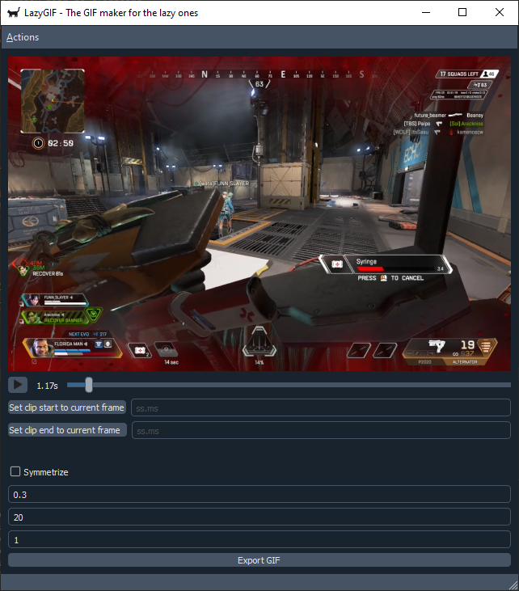

# LazyGIF

LazyGIF is a free, open-source, lightweight video editor for Windows. Say yes to your laziness and no to bloated software with 1000 features you don't need.

## Guides

### Installation

1. (Maybe optional) Install the prerequisites: 
   - [LAV Splitters](https://github.com/Nevcairiel/LAVFilters/releases/download/0.75.1/LAVFilters-0.75.1-Installer.exe)
2. Download the ZIP for Windows [here](static/LazyGIF.zip)
3. Extract the ZIP somewhere on your computer
4. Open `LazyGIF` in the extracted folder

### Convert your first video

1. Open `LazyGIF`
2. Drag & drop a video file into LazyGIF like so:

3. Select the start and end time for your video

> Leaving the start and end time empty will export the whole video

4. Click the _Export_ button

The console window will show the current process (yes, it's quite archaic but a progress bar of sorts is coming in the next big release)

The video is saved in the same folder of the input video file.
The app automatically opens the folder the videos are saved at.

## Tutorials

_(Coming soon)_

## Hotkeys/shortcuts

Import video: <kbd>CTRL</kbd>+<kbd>O</kbd>
Quit: <kbd>CTRL</kbd>+<kbd>Q</kbd>

## Features

- Drag and drop
- One-click export
- reduce size by changing the resolution and framerate
- In-app help (hover over an interactable element and look at the bottom. A help text should show)

## Roadmap

- [x] drag and drop
- [x] hotkeys/shortcut support
- [ ] asynchronous status display
- [ ] better labeling

## Changelog

### 2022-04-17

- Pulished project page

## Support or Contact

Feel free to create an issue on the GitHub project page or to contact me [via Reddit](https://www.reddit.com/user/Zenahr).